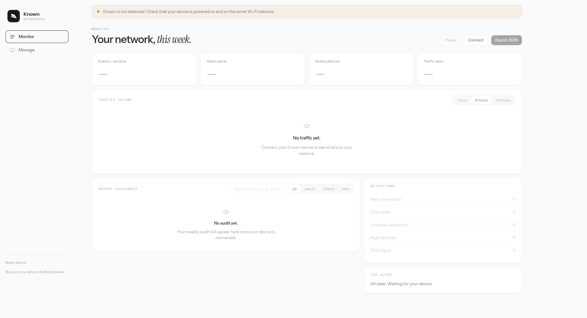

# Known Dashboard

The local monitoring app for Known, the on-device network privacy monitor by
Northsline. It connects to the Known device over your local network, pulls
recent activity, and shows every conversation your devices are having, on your own
machine.

Known is a **passive monitor**: it logs and analyzes DNS queries and shows you
what's happening on your network. It does **not** block, redirect, or interfere
with traffic: every connection goes through normally. The dashboard shows what
happened, not "what it blocked."

This repo is the **dashboard only**. Setting up a new device (USB provisioning,
device verification, Wi-Fi) lives in its own hosted app,
[known-onboard](https://github.com/northsline/known-onboard). The dashboard
assumes the device is already provisioned and reachable on your network.



## Stack

- **SvelteKit** (Svelte 5 runes) + **Vite** + **TypeScript**
- Static adapter, ships as a self-contained client bundle with no server
- No runtime dependencies beyond the framework

## Develop

```bash
npm install
npm run dev      # http://localhost:5173
```

## Build

```bash
npm run check    # type-check (must be clean)
npm run build    # outputs to ./build
npm run preview  # serve the production build locally
```

## First run

The dashboard auto-discovers your Known on the local network. It tries
`known.local` first, then falls back to a saved IP address, then lets you
enter one manually. No sticker code, no account, no setup — the device just
needs to be on the same Wi-Fi.

Provision a new device at
[known-onboard](https://github.com/northsline/known-onboard) first.

## Connection architecture

The UI never holds business logic. State lives in a single runes store
([`src/lib/stores/known.svelte.ts`](src/lib/stores/known.svelte.ts)); components
read derived views from it. The store talks to the device through one seam:

- [`src/lib/api/client.ts`](src/lib/api/client.ts): `KnownClient`, the device
  connection. It discovers the Known on the local network (mDNS /
  `known.local`) and fetches events over HTTP.

Connection lifecycle on the store:

- `start()`: called on mount; instantiates the client and runs discovery.
- `discover()`: retry discovery (wired to the TopBar **Connect** button).
- `connected` / `connecting` / `paused`: drive the global connection banner and
  the disabled states of the Pause / Connect / Export controls.

## Local QA with simulated data

For design and QA you can replay simulated traffic without a device. Flip the
flag in [`src/lib/config.ts`](src/lib/config.ts):

```ts
export const DEV_MOCK = true;
```

The mock modules ([`src/lib/data/generate.ts`](src/lib/data/generate.ts),
[`src/lib/data/static.ts`](src/lib/data/static.ts)) are dynamically imported
only when this is `true`, so production builds tree-shake them out. Leave it
`false` for shipping builds. Static detection metadata lives separately in
[`src/lib/data/detections.ts`](src/lib/data/detections.ts) (used in production,
not mock data, kept apart so importing it never drags the mock device list into
the bundle).

## Internationalization

Lightweight, dependency-free. All UI copy lives in
[`src/lib/i18n/en.ts`](src/lib/i18n/en.ts) as a typed `Dict`; components import
the active dictionary as `t` from [`src/lib/i18n`](src/lib/i18n/index.ts) and
read e.g. `t.gate.title`. v1 is **English-only**. To add a locale later:
create `xx.ts` satisfying `Dict`, register it in `index.ts`, and point
`activeLocale` at a stored or `navigator` preference.

## Project shape

```
src/
  lib/
    api/client.ts        KnownClient - device connection
    api/discovery.ts     mDNS → localStorage → manual IP
    api/adapters.ts      Firmware MVP → dashboard types
    components/          Sidebar, TopBar, EmptyState, cards, charts
    config.ts            DEV_MOCK flag, storage keys
    data/detections.ts   static DETECTIONS metadata (production, not mock)
    data/{generate,static}.ts   DEV-only mock generator + seed data
    i18n/                en.ts (Dict) + index.ts (active `t`)
    stores/known.svelte.ts   central runes store + connection lifecycle
    styles/app.css       design system (tokens, primitives)
    types.ts             domain model (NetEvent, Device, AllowEntry...)
    utils.ts             formatting helpers
  routes/
    +layout.svelte       mounts shell + banner (no gate)
    +page.svelte         Monitor: stats, traffic chart (1h/6h/24h), live feed, alerts
    manage/+page.svelte  Manage: device grid + allowlist rules
```

The app is two surfaces, kept deliberately small so it maps cleanly onto the
device and is easy to keep in sync:

- **Monitor** (`/`) — at-a-glance stats, the traffic chart with a 1h/6h/24h
  range toggle, the searchable/filterable live event feed, the detections
  breakdown, and the top alert.
- **Manage** (`/manage`) — the device grid (All / Flagged / Watched / Trusted)
  and the allowlist (add rules + active rules).

## Out of scope (tracked elsewhere)

Real Pico API implementation, device-side identity verification, desktop packaging,
and actual mDNS network discovery. Device provisioning lives in
[known-onboard](https://github.com/northsline/known-onboard).